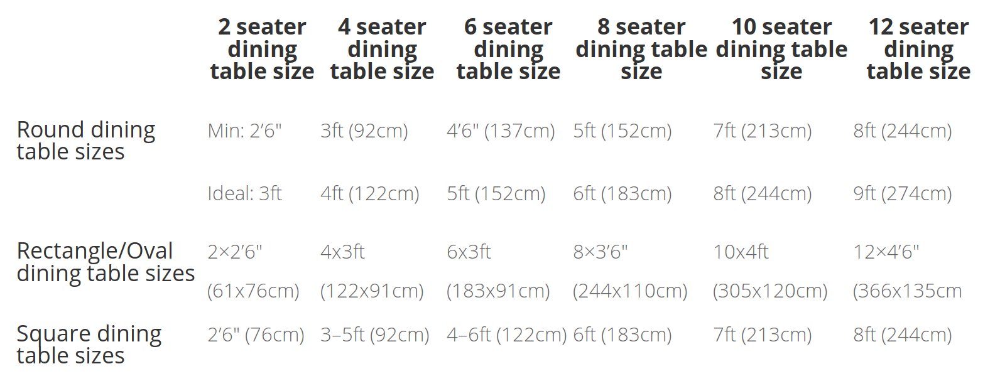

# Tablas simples

Easily produce tables in plain text (Markdown or otherwise) for your emails or documents by copying and pasting an HTML table or spreadsheet. After pasting, select the columns you need and ASCII or Markdown comes out. Good for taming unwieldy and complex tables you need to forward on emails or to copy just a section of it.

You can test it (here)[http://mirrodriguezlombardo.com/Tabla-simple-texto/].

Copy and paste the table in the first text area, then select just the columns you need and a simple table appears in the second space ready for you to copy and paste into your text editor, Markdown document or email.

Go from this HTML table...



To this:

```
|                                   | 2 seater        | 4 seater        |
|                                   |dining table size|dining table size|
|===================================|=================|=================|
| Round dining table sizes          |Min: 2’6″        |3ft (92cm)       |
|                                   |                 |                 |
|                                   |Ideal: 3ft       |4ft (122cm)      |
+-----------------------------------+-----------------+-----------------+
| Rectangle/Oval dining table sizes |2×2’6″ (61x76cm) |4x3ft (122x91cm) |
+-----------------------------------+-----------------+-----------------+
| Square dining table sizes         |2’6″ (76cm)      |3–5ft (92cm)     |
```

or this (Markdown compatible):

```
|                                  | 2 seater  <br/>dining table size    | 4 seater  <br/>dining table size |
|----------------------------------|-------------------------------------|----------------------------------|
| Round dining table sizes         |Min: 2’6″<br/><br/>Ideal: 3ft        |3ft (92cm)<br/><br/>4ft (122cm)   |
| Rectangle/Oval dining table sizes|2×2’6″ (61x76cm)                     |4x3ft (122x91cm)                  |
| Square dining table sizes        |2’6″ (76cm)                          |3–5ft (92cm)                      |
```

Which renders like this:

|                                   | 2 seater <br/>dining table size | 4 seater <br/>dining table size |
| --------------------------------- | ------------------------------- | ------------------------------- |
| Round dining table sizes          | Min: 2’6″<br/><br/>Ideal: 3ft   | 3ft (92cm)<br/><br/>4ft (122cm) |
| Rectangle/Oval dining table sizes | 2×2’6″ (61x76cm)                | 4x3ft (122x91cm)                |
| Square dining table sizes         | 2’6″ (76cm)                     | 3–5ft (92cm)                    |

(original table from [PAROTAS](http://www.parotas.com/en/calculate-best-dining-table-size/))

There are similar tools, such as [ASCII table generator](https://ozh.github.io/ascii-tables/), [markdownTables](https://jmalarcon.github.io/markdowntables/), [Markdown tables generator](https://www.tablesgenerator.com/markdown_tables), [Markdown-table](https://github.com/wooorm/markdown-table) and the closed source [Table to markdown](https://tabletomarkdown.com/), but I needed something that could handle colspans and multi-line cells as well as balancing column widths. This is still missing automatic line wraps (for example, to make the table fit in 80 columns of plain text) and rowspans.

**Tablas simples** is Javascript/jquery running in your browser. It uses the [Turndown](https://github.com/domchristie/turndown) HTML to Markdown converter and [Selection.js](https://github.com/Simonwep/selection) for x/y selection to pick just the section of the table tou nees. I also use [RequireJS](https://requirejs.org/) to make it easier for me, but it could probably be done without it, a modified version of the [Joplin Turndown plugin](https://github.com/laurent22/joplin-turndown-plugin-gfm), itself a fork of the [turndown-plugin-gfm](https://github.com/domchristie/turndown-plugin-gfm) for Github-flavored Markdown, and [DOMPurify](https://github.com/cure53/DOMPurify) to sanitize the input.
